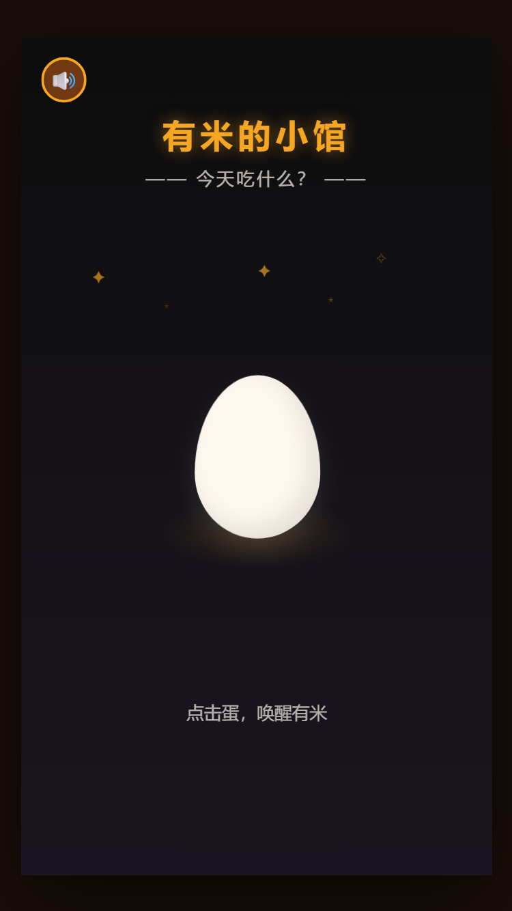
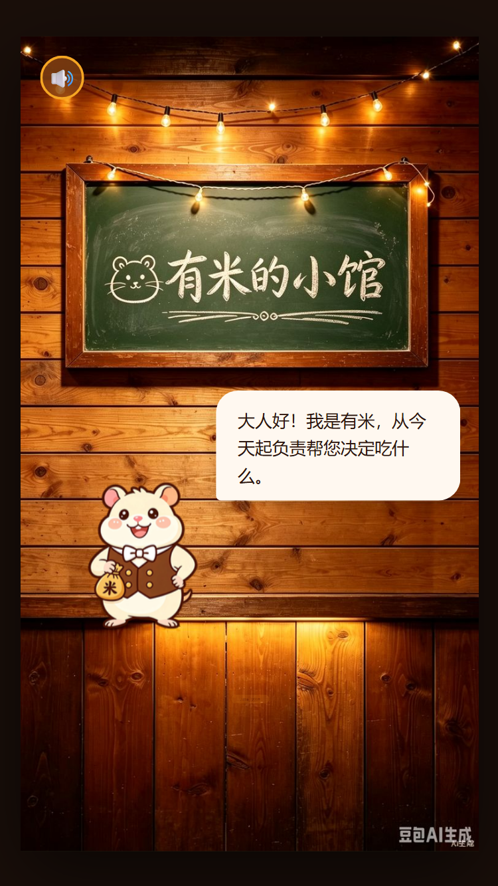
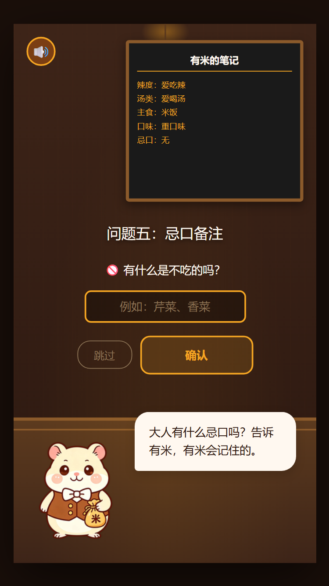
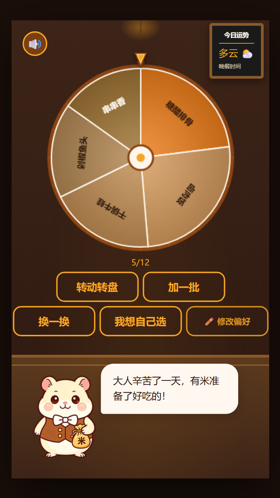
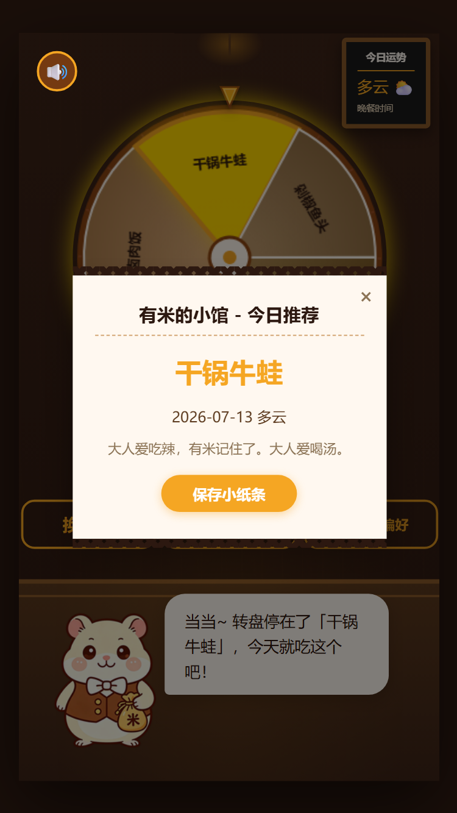
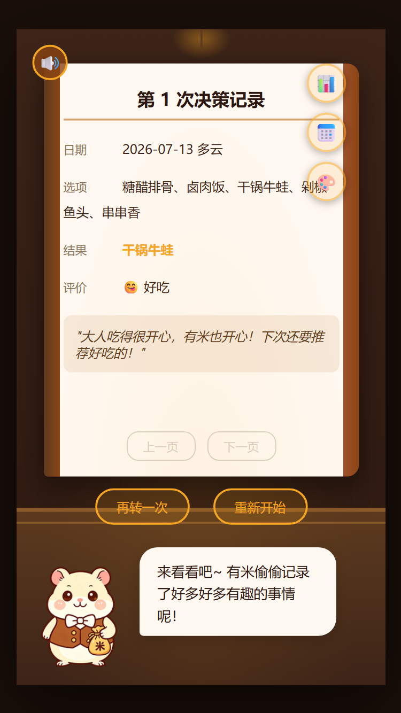
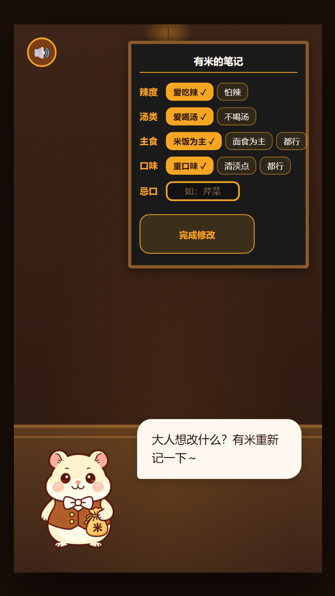

# 🐹 有米的小馆

> 一只记得你口味的电子仓鼠侍者
>
> **TRAE AI 创造力大赛 · 生活娱乐赛道参赛作品**

---

## 📖 项目简介

「有米的小馆」是一款**生活决策辅助 × 模拟养成 × 治愈陪伴**的 Web 应用。

主角有米是一只奶白色的小仓鼠，戴着圆框眼镜，系着白色围裙，经营着一家隐藏在人类世界与食物世界之间的"经典小馆"。

它的核心功能只有一个：**帮你决定今天吃什么。**

但它不是冷冰冰的随机数生成器——有米会记住你不吃芹菜，记得下雨天你总想喝热汤，记得你连续吃辣三天后第四天该换换口味了。

> 打开浏览器就能玩，无需下载安装。

**在线体验：**
- 主站：https://youni-demo.surge.sh
- 备站（GitHub Pages）：https://cc20216.github.io/younis-diner/

---

## ✨ 核心功能

### 功能一：蛋壳孵化开场动画

打开页面，深蓝黑渐变背景上，一颗发光的蛋静静等待。顶部金色标题「有米的小馆」配副标题「今天吃什么？」，5颗星星闪烁装饰。蛋下方有暖光底和闪烁提示「点击蛋，唤醒有米」。点击蛋壳后，金光迸发、粒子飞溅、屏幕震动，有米从蛋中破壳而出。





### 功能二：口味偏好学习

首次进入时，有米会像一个小侍者一样问你5个问题——辣度偏好、汤类喜好、主食偏好、口味偏好、有没有忌口。你的回答会被它用歪歪扭扭的粉笔字"记在小黑板上"，后续每次推荐都会参考。支持随时修改偏好。



### 功能三：权重转盘

输入你想吃的选项，有米会根据你的口味偏好、天气、历史反馈，把选项变成**大小不一的转盘扇区**。不是均等随机的——你爱吃的会大一点，最近吃多了的会小一点。

- 转盘转动时有米表情从期待→紧张→惊讶动态切换
- 指针越过扇区边界时有低沉咔嗒声，停下时手机震动反馈
- 点"加一批"追加更多选项（最多12个）
- "换一换"全部替换
- 还能自己输入选项追加到转盘中



### 功能四：结果推荐与小纸条

转盘停下后，有米会根据结果的权重比例做出不同表情——高权重菜品时开心飞星星，低权重时难过擦汗。然后弹出一张"小纸条"风格的推荐单，上面写着结果、日期天气、以及有米根据你的偏好写的个性化备注。



### 功能五：反馈养成

转盘出结果后，你可以告诉有米"好吃"或"踩雷"：

- **好吃** → 它比你还高兴，围裙口袋飞出金色小星星 ✨
- **踩雷** → 它耳朵垂下来，掏出小手帕擦汗，认真追问原因
- **一般** → 也会记下来，下次推荐参考

连续互动后，有米会越来越懂你。

### 功能六：记忆图鉴系统

有米用"小本本"记录每次反馈，随着使用越来越久，推荐会越来越准。

- 不吃的食物 → 权重归零
- 下雨天 → 自动推荐热汤
- 连续吃辣 → 降低辣菜权重
- 历史踩雷 → 记住教训
- 支持饮食统计和食材日历查看



### 功能七：偏好随时修改

在任何阶段都可以点击"修改偏好"按钮，有米会拿出小黑板让你修改辣度、汤类、主食、口味和忌口。修改后数据立即生效。



---

## 🎭 角色设计

有米拥有 **24 种表情姿态**，全部由 AI 生成并抠图为透明背景 PNG：

| 分类 | 表情 | 数量 |
|------|------|------|
| 默认/日常 | 默认站立、开心、思考、犯困、惊讶、悲伤、挥手、眨眼、好奇、点头 | 10 |
| 侍者/互动 | 烹饪、上茶、推荐、递送、看菜单、竖大拇指 | 6 |
| 孵化/登场 | 蜷缩破壳、抖毛站起、自信亮相 | 3 |
| 转盘/反馈 | 挥手开始、思考顿悟、紧张期待 | 3 |
| 问候/互动 | 打招呼、鞠躬致歉 | 2 |

仓鼠表情会根据转盘状态实时切换，还附带定时眨眼、闲置小动作等细节动画。

---

## 🎮 交互流程

整个 Demo 包含 5 个场景阶段：

```
Stage 1: 蛋壳孵化 ──→ Stage 2: 口味偏好问答 ──→ Stage 3: 权重转盘
                                                          │
                     Stage 5: 记忆小本本 ←── Stage 4: 结果反馈与评价
```

- **Stage 1** — 金色标题+星空下，点击蛋壳，有米破壳登场自我介绍
- **Stage 2** — 用侍者的口吻询问辣度、汤类、主食、口味、忌口等偏好（支持子步骤回退）
- **Stage 3** — 主界面：有米 + 转盘 + 输入区域，支持键盘快捷键（空格转盘、R刷新）和触摸滑动
- **Stage 4** — 转盘结果 + 小纸条推荐单 + 好吃/踩雷反馈 + 触觉振动
- **Stage 5** — 查看有米的"记忆小本本"，浏览历史互动记录

---

## 🧮 权重算法

转盘扇区大小由多维度权重综合计算：

```
最终权重 = 偏好匹配度 × 天气加成 × 顺序加成 × 历史调整 × 忌口过滤
```

| 维度 | 说明 |
|------|------|
| 偏好匹配度 | 用户口味与菜品的匹配程度（辣度、汤类、主食类型） |
| 天气加成 | 下雨天 → 热汤类权重提升（使用模拟天气数据） |
| 顺序加成 | 用户输入的第一个选项 +0.1 额外权重 |
| 历史调整 | 近期吃过多次的菜品权重降低，踩雷过的权重归零 |
| 忌口过滤 | 包含用户忌口关键词的选项，权重直接设为 0 |

扇区最小占比 8%，确保每个选项都清晰可见。

---

## 🛠 技术实现

- **开发工具：** [TRAE Work](https://www.trae.cn/)（AI IDE）
- **技术栈：** 纯前端 HTML + CSS + JavaScript（Canvas）
- **音效：** Web Audio API 合成，零外部音频文件
- **数据持久化：** localStorage
- **画布尺寸：** 375×667（移动端适配）
- **部署：** Surge.sh + GitHub Pages 双线部署

### 关键技术点

- **Canvas 状态栈管理：** `ctx.save()` / `ctx.restore()` 严格配对，防止旋转计算错误
- **Web Audio 音效合成：** 转盘咔嗒声（330Hz，0.05s）、星星飞出音效、BGM（悠闲节奏，60% 音符间距）
- **角色状态机：** IDLE / HATCHING / THINKING / DRAWING 四种状态平滑过渡
- **浏览器回退支持：** 使用 `history.pushState` / `popstate` 实现全阶段回退，偏好问答支持子步骤回退
- **图片按需加载：** 首屏只加载4张必需图，进入各阶段后500ms预加载该阶段图片
- **背景图优化：** 从4.8MB压缩到161KB（97%减少），配合HTML preload加速

---

## 📁 项目结构

```
有米的小馆/
├── .github/
│   └── workflows/
│       └── deploy.yml              # GitHub Pages 自动部署
├── demo/                           # Demo 演示文件
│   ├── youni-demo.html             # 主页面
│   ├── index.html                  # 入口重定向
│   ├── style.css                   # 样式表
│   ├── app.js                      # 核心逻辑
│   ├── bg-tavern.jpg               # 酒馆背景图（压缩版，161KB）
│   ├── 背景.png                    # 酒馆背景图（原始版，4.8MB）
│   ├── bg-C-fullpage.jpg           # 全页背景
│   ├── sign-C-cutout.jpg           # 招牌素材
│   ├── sign-tavern.png             # 酒馆招牌
│   ├── youni-demo-standalone.html  # 零依赖单文件版
│   ├── youni/                      # 有米角色表情素材（24张透明背景 PNG）
│   └── screenshots/                # 效果截图
│       ├── 01-opening.png          # 开场标题+星空
│       ├── 02-hatched.png          # 有米破壳登场
│       ├── 03-preferences.png      # 口味偏好问答
│       ├── 04-wheel.png            # 权重转盘主界面
│       ├── 05-result.png           # 转盘结果小纸条
│       ├── 06-memory.png           # 记忆图鉴
│       └── 07-edit-pref.png        # 修改偏好
├── proposal/                       # 提案展示
│   ├── youni-proposal.html         # 创意提案展示页
│   └── 发帖材料.txt                 # 论坛发帖参考材料
├── .gitignore
└── README.md
```

---

## 🎯 情感设计理念

产品的情感曲线设计为三层升级：

```
第一层 "有用" ──→ 第二层 "懂我" ──→ 第三层 "等我回家"
  转盘帮我做了      它记得我不吃芹菜    深夜打开看到它
  决定，扇区分析      下雨天自动推热汤    趴在吧台上睡着了
  有道理
```

> 从"这个转盘挺有用"到"它在等我回家"——这就是「有米的小馆」想创造的情感价值。

---

## 📅 7月13日更新内容

- **开场动画全新设计：** 蛋孵化画面重做，新增金色标题、闪烁星空、暖光底、引导提示
- **浏览器回退支持：** 全阶段支持浏览器回退按钮，偏好问答支持子步骤回退
- **图片按需加载优化：** 首屏只加载4张图，背景图从4.8MB压缩到161KB
- **双线部署：** 同时部署在 surge.sh 和 GitHub Pages

---

## 🔗 相关链接

- **在线体验（主站）：** [https://youni-demo.surge.sh](https://youni-demo.surge.sh)
- **在线体验（备站）：** [https://cc20216.github.io/younis-diner/](https://cc20216.github.io/younis-diner/)
- **比赛主页：** [https://www.trae.cn/ai-creativity](https://www.trae.cn/ai-creativity)
- **开发工具：** [TRAE Work](https://www.trae.cn/)

---

## 📝 参赛信息

| 项目 | 内容 |
|------|------|
| 赛道 | 生活娱乐 |
| 开发工具 | TRAE AI IDE |
| Demo 平台 | Web（浏览器打开即玩） |
| 比赛名称 | TRAE AI 创造力大赛 |

---

<p align="center">
  <sub>Made with ❤️ and 🐹 by <a href="https://github.com/cc20216">cc20216</a></sub>
  <br>
  <sub>Built entirely with TRAE Work — from character design to deployment</sub>
</p>
